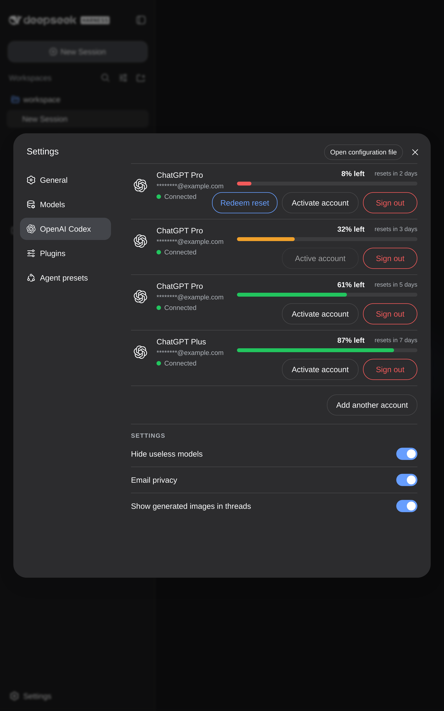

<p align="center">
  
</p>

# OpenAI Codex Plugin for the DeepSeek Harness

Lets you manage your pool of OpenAI subscriptions in DSH.

## New Tools

- Websearch
- Image Generation

## Install the DeepSeek Harness Codex plugin

Add it to your DSH Web profile:

```sh
dsh plugin --profile web add github:Eve-146T/DSH-CODEX-SUBSCRIPTION-POOL
```

## Tutorial

```sh
# install the plugin
dsh plugin --profile web add github:Eve-146T/DSH-CODEX-SUBSCRIPTION-POOL
# restart dsh
dsh --profile web
```

Then:

1. Open Settings
2. Click OpenAI Codex in the sidebar and login
3. Choose OpenAI Codex as the provider in the Models tab

## Development

```sh
pnpm install
pnpm run build
pnpm test
dsh plugin --profile web add ./openai-codex-auth
```

## License

This project is distributed under [GPL-3.0-only](./LICENSE).
