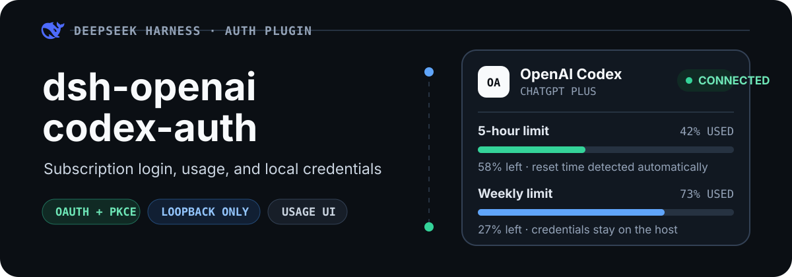
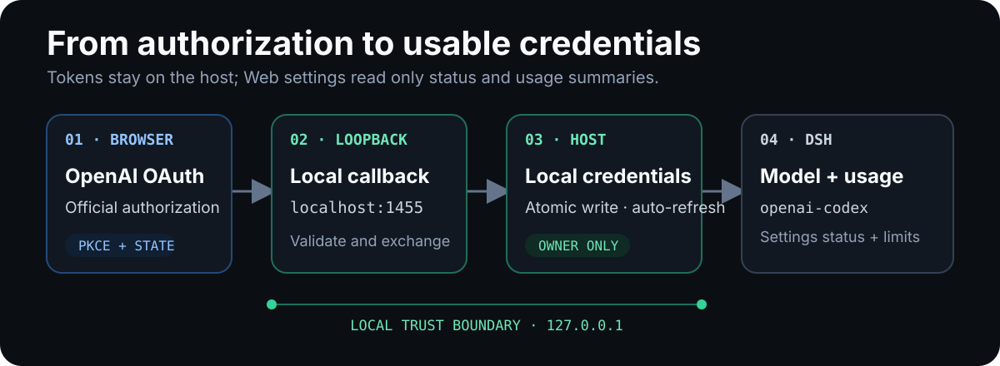

<p align="center">
  
</p>

<p align="center">
  <strong>Connect your ChatGPT subscription to DeepSeek Harness.</strong><br>
  Sign in with OpenAI OAuth, view Codex usage from DSH settings, and automatically provide valid credentials to the <code>openai-codex</code> model provider.
</p>

<p align="center">
  <a href="#quick-start">Quick start</a> ·
  <a href="#features">Features</a> ·
  <a href="#how-it-works">How it works</a> ·
  <a href="#configuration">Configuration</a> ·
  <a href="#credential-security-boundary">Security boundary</a>
</p>

## Quick start

Install the plugin into DSH's `web` profile:

```sh
dsh plugin --profile web add github:muxu9/dsh-openai-codex-auth
```

Start or restart that profile:

```sh
dsh --profile web
```

Then connect your account:

1. Open DSH Web and go to **Settings → OpenAI Codex**.
2. Select **Sign in with OpenAI** and complete the sign-in on OpenAI's authorization page.
3. Return to DSH and select `openai-codex` under **Settings → Model Providers**.

> [!IMPORTANT]
> The login management API listens only on `127.0.0.1`. Open the settings page and complete authorization on the same computer that runs the DSH Web profile.

## Features

| Feature | Description |
| --- | --- |
| OpenAI subscription login | Connect a ChatGPT Plus, Pro, Team, or Enterprise account through OAuth |
| Codex usage dashboard | View short-window and weekly usage, remaining capacity, and reset times |
| Automatic credential renewal | Refresh expiring tokens and update local credentials automatically |
| DSH model integration | Supply a valid token to the `openai-codex` model provider |
| Settings management | View status, refresh usage, sign in again, or sign out |

## How it works

<p align="center">
  
</p>

1. The plugin generates a PKCE verifier, challenge, and random `state`, then opens OpenAI's authorization page.
2. OpenAI returns the authorization result to local port `localhost:1455`; the plugin validates `state` and exchanges the authorization code for tokens.
3. Credentials are written atomically to a local file, and DSH credentials inject the access token as `DSH_OPENAI_CODEX_TOKEN`.
4. The settings page reads login status and Codex usage through the local `127.0.0.1:1456` control service. It never receives the tokens themselves.

## Configuration

The plugin normally requires no additional configuration. Its default credentials file is:

```text
$DSH_HOME/openai-codex-auth.json
```

To use a different location, set `path` in the Cordis configuration:

```yaml
- insert:
    - id: openai-codex-auth
      name: dsh-openai-codex-auth
      config:
        path: /secure/path/openai-codex-auth.json
```

`path` takes precedence over `dshHome`.

## Credential security boundary

This section describes only how the plugin handles local credentials and management APIs. It does not represent or guarantee any outcome from OpenAI account risk controls.

- OAuth authorization uses PKCE and a random `state` to prevent callback mix-ups.
- Credential directories and files are created with owner-only permissions and updated atomically.
- Access and refresh tokens remain on the host; the web page never reads or stores them.
- The control service listens only on `127.0.0.1` and accepts only the local DSH Web origin.
- State-changing requests such as sign-out require a CSRF token.

## Troubleshooting

<details>
<summary><strong>The settings page says it cannot connect to the local Codex plugin service</strong></summary>

Confirm that the `web` profile is running and open DSH Web on the same computer. Restart the profile after installing or updating the plugin.

</details>

<details>
<summary><strong>No authorization page appears after selecting sign in</strong></summary>

Your browser may have blocked the pop-up. Allow DSH Web to open pop-ups, then select **Sign in with OpenAI** again.

</details>

<details>
<summary><strong>The account is connected, but no usage window is shown</strong></summary>

Select **Refresh usage** to retry. If OpenAI does not currently return a displayable usage window, the plugin keeps the account connected and reports the condition in settings.

</details>

<details>
<summary><strong>How do I connect to OpenAI through an HTTP proxy?</strong></summary>

The plugin uses Node.js's native `fetch`. Before starting DSH, set `HTTP_PROXY`, `HTTPS_PROXY`, and optionally `NO_PROXY`, then enable Node.js environment proxy support with `NODE_USE_ENV_PROXY=1`.

```sh
NODE_USE_ENV_PROXY=1 HTTP_PROXY=http://127.0.0.1:7890 HTTPS_PROXY=http://127.0.0.1:7890 dsh --profile web
```

</details>

## Local development

```sh
pnpm install
pnpm run build
pnpm test
dsh plugin --profile web add ./openai-codex-auth
```

## License

[MIT](./LICENSE)
